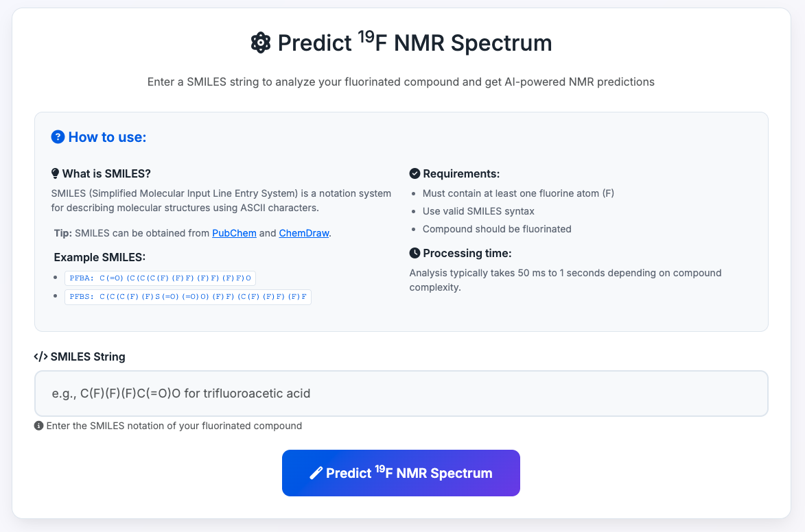

# 19F NMR Spectrum Predictor

A web application that predicts 19F NMR spectra for fluorinated compounds using machine learning. The application accepts SMILES strings as input and outputs predicted NMR spectra, molecular structures, and detailed analysis.



## 🌟 Features

- **SMILES Input**: Accepts chemical structure notation for easy compound input
- **AI-Powered Prediction**: Uses a trained neural network for accurate 19F NMR spectrum prediction
- **Molecular Visualization**: Generates and displays molecular structures with fluorine atom highlighting
- **Confidence Levels**: Provides L1-L6 confidence indicators for each predicted peak
- **Professional UI**: Modern, responsive web interface built with Bootstrap 5
- **Real-time Validation**: Client-side SMILES validation with immediate feedback
- **Docker Support**: Containerized application for easy deployment

## 🚀 Quick Start

### Option 1: Docker (Recommended)

```bash
# Pull the image from Docker Hub
docker pull dandanrao/19nmr-predictor_ffnn:latest

# Run the container
docker run -d -p 5002:5002 --name nmr-predictor dandanrao/19nmr-predictor_ffnn:latest

# Access the web app
open http://localhost:5002
```

### Option 2: Local Development

```bash
# Clone the repository
git clone <your-repo-url>
cd Application_19F_NMR_Spectra_predictor_FFNN

# Install dependencies
pip install -r requirements.txt

# Run the application
python app.py

# Access the web app
open http://localhost:5002
```

### Option 3: Docker Compose

```bash
# Start with docker-compose
docker-compose up -d

# Access the web app
open http://localhost:5002
```

## 🧪 How to Use

### 1. **Enter SMILES String**
Input a SMILES representation of your fluorinated compound. Examples:
- **PFBA**: `C(=O)(C(C(C(F)(F)F)(F)F)(F)F)O`
- **PFBS**: `C(C(C(F)(F)S(=O)(=O)O)(F)F)(C(F)(F)F)(F)F`

### 2. **Get Predictions**
The application will generate:
- **Molecular Structure**: Visual representation with fluorine atoms highlighted in gold
- **Predicted 19F NMR Spectrum**: Peak positions with confidence level labels (L1-L6)
- **Detailed Analysis**: Confidence levels and summary statistics

### 3. **Understanding Results**
- **Green bars**: High confidence predictions
- **Blue bars**: Lower confidence predictions
- **L1-L6 labels**: Confidence level indicators above each peak

## 🔧 Technical Details

### Architecture
- **Backend**: Flask web framework
- **ML Model**: TensorFlow Sequential neural network
- **Chemistry**: RDKit for molecular handling and visualization
- **Visualization**: Matplotlib for NMR spectrum generation
- **Frontend**: Bootstrap 5, Font Awesome, custom CSS

### Model Information
- **Type**: Feed-forward neural network (FFNN)
- **Input**: Molecular descriptors
- **Output**: 19F NMR chemical shifts
- **Training**: Fluorinated compounds dataset
- **Performance**: Optimized for speed and accuracy

### Dependencies
- see requirements.txt file and Dockerfile

## 🐳 Docker Deployment

### Building the Image

```bash
# Build locally
docker build -t dandanrao/19nmr-predictor_ffnn:latest .

# Push to Docker Hub
docker login
docker push dandanrao/19nmr-predictor_ffnn:latest
```

### Running in Production

```bash
# Run with environment variables
docker run -d \
  -p 5002:5002 \
  -e FLASK_ENV=production \
  -e SECRET_KEY=your-secret-key \
  --name nmr-predictor \
  dandanrao/19nmr-predictor_ffnn:latest
```

### Health Checks
The application includes built-in health monitoring:
```bash
# Check container health
curl http://localhost:5002/health
```

## 🌐 Cloud Deployment

### AWS ECS/Fargate
```yaml
# task-definition.json
{
  "family": "nmr-predictor",
  "containerDefinitions": [{
    "name": "nmr-predictor",
    "image": "dandanrao/19nmr-predictor_ffnn:latest",
    "portMappings": [{"containerPort": 5002}],
    "healthCheck": {
      "command": ["CMD-SHELL", "curl -f http://localhost:5002/health"]
    }
  }]
}
```

### Google Cloud Run
```bash
# Deploy to Cloud Run
gcloud run deploy nmr-predictor \
  --image dandanrao/19nmr-predictor_ffnn:latest \
  --platform managed \
  --port 5002 \
  --allow-unauthenticated
```

### Azure Container Instances
```bash
# Deploy to Azure
az container create \
  --resource-group myResourceGroup \
  --name nmr-predictor \
  --image dandanrao/19nmr-predictor_ffnn:latest \
  --ports 5002 \
  --dns-name-label nmr-predictor
```

## 📊 Performance

- **Prediction Time**: 50ms to 1 seconds (depending on compound complexity)

## 🔒 Security Considerations

- **Input Validation**: Client and server-side SMILES validation
- **File Upload Limits**: Restricted to prevent abuse
- **Non-root User**: Container runs as non-privileged user
- **Health Monitoring**: Built-in health checks for production monitoring

## 🐛 Troubleshooting

### Common Issues

**Container won't start:**
```bash
# Check logs
docker logs nmr-predictor

# Verify port mapping
docker port nmr-predictor
```

**Import errors:**
```bash
# Rebuild with proper dependencies
docker build --no-cache -t dandanrao/19nmr-predictor_ffnn:latest .
```

**Performance issues:**
```bash
# Check resource usage
docker stats nmr-predictor

# Monitor health endpoint
curl http://localhost:5002/health
```

### Logs and Debugging
```bash
# View application logs
docker-compose logs -f nmr-predictor

# Access container shell
docker exec -it nmr-predictor /bin/bash
```

## 📚 API Reference

### Endpoints

- **GET /** - Main web interface
- **POST /** - Submit SMILES for prediction
- **GET /health** - Health check endpoint

### Request Format
```json
{
  "smiles": "C(=O)(C(C(C(F)(F)F)(F)F)(F)F)O"
}
```

### Response Format
```json
{
  "molecular_structure": "base64_encoded_image",
  "nmr_spectrum": "base64_encoded_plot",
  "prediction_table": "html_table",
  "confidence_levels": "L1-L6 indicators"
}
```

## 🤝 Contributing

1. Fork the repository
2. Create a feature branch
3. Make your changes
4. Test thoroughly
5. Submit a pull request

## 📄 License

This project is licensed under the MIT License - see the LICENSE file for details.

## 🙏 Acknowledgments

- **RDKit**: Chemical informatics toolkit
- **TensorFlow**: Machine learning framework
- **Flask**: Web framework
- **Bootstrap**: UI framework

## 📞 Support

For questions or issues:
- Create an issue in the repository
- Check the troubleshooting section
- Review the logs for error details

---

**Note**: This application is designed for research and educational purposes. Always verify predictions with experimental data for critical applications.